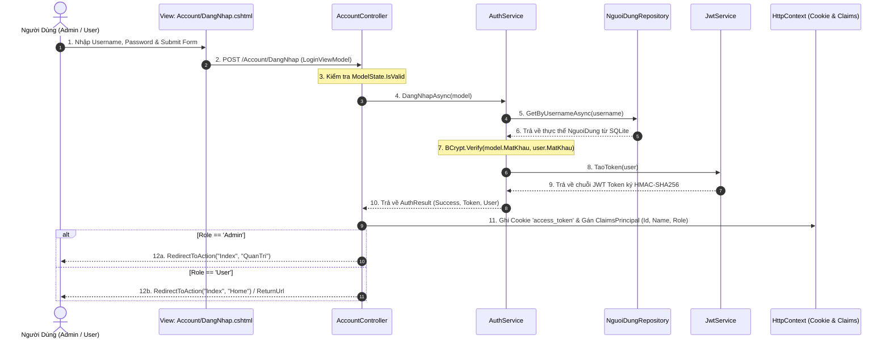
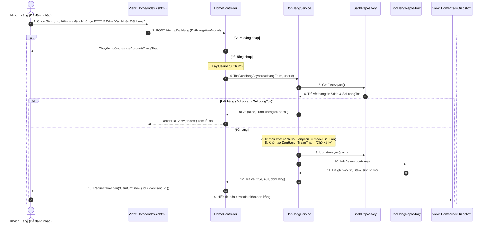

# 📘 TÀI LIỆU TOÀN DIỆN: KIẾN TRÚC HỆ THỐNG & LUỒNG XỬ LÝ DỮ LIỆU
**Dự án:** Web Bán Sách "Nhà Giả Kim" (ASP.NET Core 8.0 MVC)  
**Kiến trúc:** Clean 4-Tier Architecture (**View $\rightarrow$ Controller $\rightarrow$ Service $\rightarrow$ Repository $\rightarrow$ DbContext $\rightarrow$ SQLite**)  
**Bảo mật:** Băm mật khẩu bằng thuật toán **BCrypt (kèm Salt ngẫu nhiên)** + Xác thực **JWT Token** & Cookie Claims.

---

## 📑 MỤC LỤC
1. [Sơ đồ kiến trúc 4 tầng hoàn chỉnh (Architecture Overview)](#1-sơ-đồ-kiến-trúc-4-tầng-hoàn-chỉnh)
2. [Cơ chế băm mật khẩu bảo mật (BCrypt Hashing)](#2-cơ-chế-băm-mật-khẩu-bảo-mật-bcrypt-hashing)
3. [Luồng 1: Đăng nhập & Xác thực JWT Token (Auth Flow)](#3-luồng-1-đăng-nhập--xác-thực-jwt-token-auth-flow)
4. [Luồng 2: Đăng ký thành viên mới (Register Flow)](#4-luồng-2-đăng-ký-thành-viên-mới-register-flow)
5. [Luồng 3: Đặt mua sách trực tuyến (Customer Order Flow)](#5-luồng-3-đặt-mua-sách-trực-tuyến-customer-order-flow)
6. [Luồng 4: Admin quản lý hóa đơn & thống kê doanh thu (Admin Management Flow)](#6-luồng-4-admin-quản-lý-hóa-đơn--thống-kê-doanh-thu-admin-management-flow)
7. [Bảng tổng hợp ánh xạ Controller - Service - Repository - Database](#7-bảng-tổng-hợp-ánh-xạ-controller---service---repository---database)

---

## 1. SƠ ĐỒ KIẾN TRÚC 4 TẦNG HOÀN CHỈNH

```
┌──────────────────────────────────────────────────────────────┐
│                    1. GIAO DIỆN (VIEW)                       │
│    Razor Views (.cshtml), ViewModels, Bootstrap 5, AJAX/JS   │
└──────────────────────────────┬───────────────────────────────┘
                               │ HTTP Request (GET/POST)
                               ▼
┌──────────────────────────────────────────────────────────────┐
│                  2. ĐIỀU KHIỂN (CONTROLLERS)                 │
│  - AccountController: Đăng nhập, Đăng ký, Lịch sử đơn hàng   │
│  - HomeController: Đặt mua sách, Review nội dung, Hóa đơn    │
│  - QuanTriController: Quản lý hóa đơn, Duyệt giao, Thống kê  │
└──────────────────────────────┬───────────────────────────────┘
                               │ Gọi hàm nghiệp vụ (Business Call)
                               ▼
┌──────────────────────────────────────────────────────────────┐
│                 3. DỊCH VỤ (SERVICE LAYER)                   │
│  - AuthService: Băm BCrypt & So khớp mật khẩu               │
│  - JwtService: Ký & Giải mã JWT Token bằng HMAC-SHA256       │
│  - DonHangService: Kiểm tra tồn kho, Tính tiền, Điều phối    │
│  - SachService & FeedbackService: Xử lý sách & Đánh giá      │
└──────────────────────────────┬───────────────────────────────┘
                               │ Gọi truy xuất dữ liệu (Data Call)
                               ▼
┌──────────────────────────────────────────────────────────────┐
│               4. TRUY XUẤT DỮ LIỆU (REPOSITORY LAYER)        │
│  - DonHangRepository: CRUD hóa đơn, Thống kê, Filter LINQ    │
│  - NguoiDungRepository: Tìm theo username/id, Thêm user      │
│  - SachRepository: Lấy thông tin sách, Cập nhật tồn kho      │
│  - FeedbackRepository: Lấy review đã duyệt, Thêm feedback    │
└──────────────────────────────┬───────────────────────────────┘
                               │ Entity Framework Core (LINQ)
                               ▼
┌──────────────────────────────────────────────────────────────┐
│               5. CƠ SỞ DỮ LIỆU (DATABASE CONTEXT)            │
│         AppDbContext ──▶ SQLite Database (bansach.db)        │
│         (Bảng: NguoiDung, Sach, DonHang, Feedback)           │
└──────────────────────────────────────────────────────────────┘
```

---

## 2. CƠ CHẾ BĂM MẬT KHẨU BẢO MẬT (BCRYPT HASHING)

1. **Khi Đăng ký tài khoản mới ([Services/AuthService.cs](file:///E:/BanSachMvc/Services/AuthService.cs)):**
   * Mật khẩu được băm: `string hashedPassword = BCrypt.Net.BCrypt.HashPassword(model.MatKhau);`
   * BCrypt tự động tạo Salt ngẫu nhiên 128-bit chống lại tấn công Rainbow Table.
   * Gọi `_userRepo.AddAsync(newUser)` để lưu chuỗi băm vào bảng `NguoiDung`.

2. **Khi Đăng nhập:**
   * Lấy tài khoản từ `_userRepo.GetByUsernameAsync(username)`.
   * So khớp mật khẩu: `bool hopLe = BCrypt.Net.BCrypt.Verify(model.MatKhau, user.MatKhau);`
   * Trả về `true` nếu đúng, `false` nếu sai mà không bao giờ giải mã ngược mật khẩu.

---

## 3. LUỒNG 1: ĐĂNG NHẬP & XÁC THỰC JWT TOKEN (AUTH FLOW)



---

## 4. LUỒNG 2: ĐẶT MUA SÁCH TRỰC TUYẾN (CUSTOMER ORDER FLOW)



---

## 5. LUỒNG 3: ADMIN QUẢN LÝ HÓA ĐƠN & THỐNG KÊ DOANH THU

1. **Truy cập Dashboard Quản Trị (`GET /QuanTri`):**
   * Bảo vệ bởi thuộc tính `[Authorize(Roles = "Admin")]`.
   * Controller gọi [`DonHangService.LayThongKeAsync()`](file:///E:/BanSachMvc/Services/DonHangService.cs) $\rightarrow$ gọi [`DonHangRepository.GetStatsAsync()`](file:///E:/BanSachMvc/Repositories/DonHangRepository.cs) tính toán thống kê KPI.
   * Controller gọi [`DonHangService.LayDanhSachDonHangAsync(trangThai, timKiem)`](file:///E:/BanSachMvc/Services/DonHangService.cs) $\rightarrow$ gọi [`DonHangRepository.GetAllAsync(trangThai, timKiem)`](file:///E:/BanSachMvc/Repositories/DonHangRepository.cs) với LINQ `.Include(d => d.NguoiDung)` và `.Include(d => d.Sach)` để đổ dữ liệu xuống bảng Data Table trong [Views/QuanTri/Index.cshtml](file:///E:/BanSachMvc/Views/QuanTri/Index.cshtml).

2. **Duyệt giao hàng / Đổi trạng thái hóa đơn (`POST /QuanTri/CapNhatTrangThai`):**
   * Form gửi `id` và `trangThaiMoi`.
   * Controller gọi `_donHangService.CapNhatTrangThaiAsync(id, trangThaiMoi)` $\rightarrow$ gọi `_donHangRepo.UpdateStatusAsync(id, trangThaiMoi)`.
   * Cập nhật cột `TrangThai` trong bảng `DonHang` của SQLite.

---

## 6. BẢNG TỔNG HỢP ÁNH XẠ TOÀN BỘ 4 TẦNG

| Chức Năng | Controller | Service Xử Lý | Repository Tương Tác | Bảng Database | Kết Quả Trả Về |
| :--- | :--- | :--- | :--- | :--- | :--- |
| **Đăng Nhập** | `AccountController.DangNhap` | `AuthService` (BCrypt), `JwtService` | `NguoiDungRepository` | `NguoiDung` (Select) | Cấp JWT Token + Cookie $\rightarrow$ Redirect |
| **Đăng Ký** | `AccountController.DangKy` | `AuthService.DangKyAsync` | `NguoiDungRepository` | `NguoiDung` (Insert) | Tạo tài khoản $\rightarrow$ Tự động đăng nhập |
| **Đặt Sách Mua** | `HomeController.DatHang` | `DonHangService.TaoDonHangAsync` | `SachRepository`, `DonHangRepository` | `Sach` (Update), `DonHang` (Insert) | Redirect `/Home/CamOn/{id}` |
| **Xem Hóa Đơn** | `HomeController.CamOn` | `DonHangService.LayDonHangTheoIdAsync` | `DonHangRepository` | `DonHang`, `Sach` (Select) | View `CamOn.cshtml` |
| **Lịch Sử Đơn** | `AccountController.LichSuDonHang` | `DonHangService.LayDanhSachDonHangCuaUserAsync` | `DonHangRepository` | `DonHang` (Select WHERE NguoiDungId) | View `LichSuDonHang.cshtml` |
| **Admin Hóa Đơn** | `QuanTriController.Index` | `DonHangService.LayDanhSachDonHangAsync` | `DonHangRepository` | `DonHang`, `NguoiDung` (Select JOIN) | View `Index.cshtml` (Dashboard & KPI) |
| **Chi Tiết HĐ** | `QuanTriController.ChiTietHoaDon` | `DonHangService.LayDonHangTheoIdAsync` | `DonHangRepository` | `DonHang`, `Sach` (Select) | View `ChiTietHoaDon.cshtml` |
| **Đổi Trạng Thái**| `QuanTriController.CapNhatTrangThai` | `DonHangService.CapNhatTrangThaiAsync` | `DonHangRepository` | `DonHang` (Update TrangThai) | Redirect `/QuanTri` |
| **Quản Lý Feedback**| `QuanTriController.QuanLyFeedback` | `FeedbackService.LayTatCaFeedbackAsync` | `FeedbackRepository` | `Feedback` (Select) | View `QuanLyFeedback.cshtml` |
